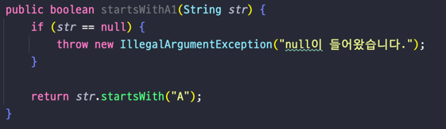
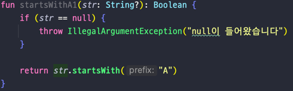
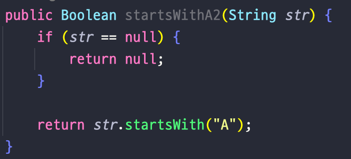
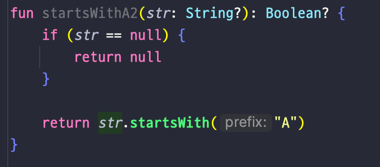
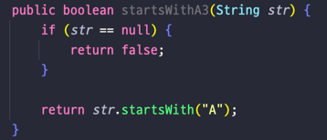
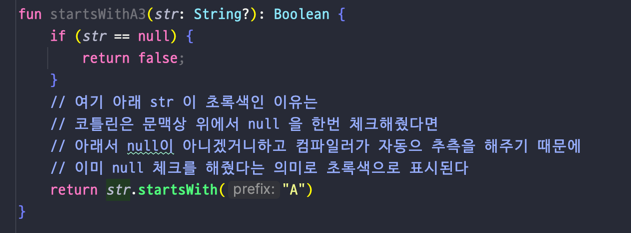
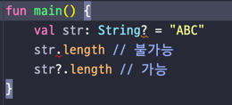

# Lec 02. 코틀린에서 null을 다루는 방법
### - 코틀린은 null이 들어갈 수 있는 변수를 완전히 다르게 취급한다

### 1. Kotlin에서의 null 체크
### 2. Safe Call 과 Elvis 연산자(Null 이 가능한 타입만을 위한 기능)
### 3. 널 아님 단언!!(Null 이 가능한 타입만을 위한 기능)
### 4. 플랫폼 타입(Null 이 가능한 타입만을 위한 기능)

-----------------------------------------------------------------------

#### 1. Kotlin 에서의 null 체크

1. str이 null일 경우 Exception을 낸다
- Java

- Kotlin

2. str이 null일 경우 null을 반환한다
- Java

- Kotlin

3. str이 null일 경우 false를 반환한다.
- Java

- Kotlin

- 정리
  - Kotlin 에서는 null 이 가능한 타입을 완전히 다르게 취급한다.
  - null 이 들어갈 수 있거나 null 이 리턴될 수 있는 타입이라면 타입 뒤에 ? 를 붙여준다.
  - null 이 들어갈 수 있는 타입의 변수로 함수 호출시 위에서 null 체크를 해주지 않는다면 에러가 발생한다.

#### 2. Safe Call 과 Elvis 연산자(Null 이 가능한 타입만을 위한 기능)
- null 이 아니면 실행하고, null 이면 실행하지 않는다 (그대로 null)

- str 타입인 String 에 ? 가 붙어있기 때문에 null 체크없이 str 을 이용해 무언가를 바로 호출할 수 없다 
- 하지만 str 뒤에 .?를 붙이면 str 을 이용해 무언가를 호출할 수 있다 이것이 바로 safe call.
- Safe Call == ?.
  - 앞에 있는 변수가 null 이 아니면 뒤에 딸려오는 함수나 프로퍼티 등을 실행시키고
  - 앞에 있는 변수가 null 이면 이 값 그대로가 null 이 된다.
- Elvis 연산자 == ?: 
  - Safe Call 과 같이 쓰이며 예를 들어 str?.length 에서 str 이 null 일 경우 null 대신 나올 값을 지정해준다
  - 예시 : str?.length ?: 0 이렇게하면 str 이 null 이면 0이 출력된다.

#### 3. 널 아님 단언!!(Null 이 가능한 타입만을 위한 기능)
- nullable type 이지만, 아무리 생각해도 null 이 될 수 없는 경우
- !!. 으로 해결!
- 하지만 만약 null 이 들어올 경우 NPE 가 발생하기 때문에 정말 null 이 아닌게 확실한 경우에만 널 아님 단언!! 을 사용하자!

#### 4. 플랫폼 타입(Null 이 가능한 타입만을 위한 기능)
- Kotlin 에서 Java 코드를 가져다 사용할 때 어떤 타입이 null 이 될 수 있는지 없는지를 어떻게 처리해야할까?
- 플랫폼 타입이란 코틀린이 null 관련 정보를 알 수 없는 타입으로 Runtime 시 Exception 이 날 수 있다.
  - 보통 @Nullable 이나 @NotNull 을 붙여 null 관련 정보를 알려준다

#### 정리
- 코틀린에서 null 이 들어갈 수 있는 타입은 완전히 다르게 간주된다.
  - 한 번 null 검사를 하면 non-null 임을 컴파일러가 알 수 있다.
- null 이 아닌 경우에만 호출되는 Safe Call (?.) 이 있다.
- null 인 경우에만 호출되는 Elvis 연산자 (?:) 가 있다.
- null 이 절대 아닐때 사용할 수 있는 널 아님 단언(!!) 이 있다.
- Kotlin 에서 Java 코드를 사용할 때 플랫폼 타입 사용에 유의해야 한다.
  - Java 코드를 읽으며 널 가능성 확인 / Kotlin 으로 Wrapping
