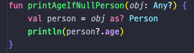

## 3강. 코틀린에서 Type을 다루는 방법

### 1. 기본 타입 
### 2. 타입 캐스팅
### 3. Kotlin 의 3가지 특이한 타입
### 4. String Interpolation, String indexing

---

## 1. 기본 타입 (Lec03Main1)

- Byte, Short, **Int, Long, Float, Double**, 부호없는 정수들
- 코틀린에서는 선언된 기본값을 보고 타입을 추론한다.
- Java 와 다른 내용
  - Java : 기본 타입간의 변환은 암시적으로 이루어질 수 있다.
  - Kotlin : 기본 타입간의 변환은 명시적으로 이루어져야 한다.
    - 
    - 변환하고자 하는 타입 뒤에 .to변환타입() 을 붙여줘야 한다
  - 변수가 nullable 이라면 적절한 처리가 필요하다.
    - 
    - Safe Call(?.) 과 Elvis(?:) 연산자를 사용해야한다.


## 2. 타입 캐스팅 (Lec03Main2)
- 기본 타입이 아닌 일반 타입에 대한 캐스팅은 어떻게 해야할까?

- Java 의 instanceof => is
- Java 의 (Person) obj => obj as Person (얘는 위에서 체크를 했기 때문에 생략도 가능[자바에선 무조건 변환을 해줘야 됨])
  - 스마트 캐스트
    - 
    - obj as Person 없이 바로 obj 를 Person 처럼 사용 가능
- obj 에 null 이 들어올 수 있다면?
  - 
  - 
  - obj 의 타입인 Any 에 ? 를 붙여 null 이 들어올 수도 있음을 표시하고
  - obj 가 null 일 수도 있으므로 obj 의 타입을 바꿔주는 as 에도 ? 를 붙여 Safe Call 처리를 해준다
  - println() 안에 person 에도 person 이 null 이 될 수 있으므로 Safe Call 처리를 해준다

### 정리
  1. value is Type
     - value 가 Type 이면 : true
     - value 가 Type 이 아니면 : false
  2. value !is Type
     - value 가 Type 이면 : false
     - value 가 Type 이 아니면 : true
  3. value as Type
     - value 가 Type 이면 : Type 으로 타입 캐스팅
     - value 가 Type 이 아니면 : 예외 발생 
  4. value as? Type (안전한 타입 형변환 : 에러가 발생하지 않음)
     - value 가 Type 이면 : Type 으로 타입 캐스팅
     - value 가 Null 이면 : Null
     - value 가 Type 이 아니면 : Null


## 3. Kotlin 의 3가지 특이한 타입
- Any
- Unit
- Nothing

### Any
  - Java 의 Object 역할 (모든 객체의 최상위 타입)
  - 모든 Primitive Type 의 최상위 타입도 Any 이다.
  - Any 자체로는 null 을 포함할 수 없어 null 을 포함하고 싶다면, Any? 로 표현
  - Any 에 equals / hashCode / toString 존재

### Unit
  - Unit 은 Java 의 void 와 동일한 역할
  - (살짝 어려운 내용) void 와 다르게 Unit 은 그 자체로 타입 인자로 사용 가능하다(void 는 제네릭타입으로 사용시 Void 라는게 따로 있음)
  - 함수형 프로그래밍에서 Unit 은 단 하나의 인스턴스만 갖는 타입을 의미. 즉 코틀린의 Unit 은 실제 존재하는 타입이라는 것을 표현

### Nothing
  - Nothing 은 함수가 정상적으로 끝나지 않았다는 사실을 표현하는 역할
  - 무조건 예외를 반환하는 함수 / 무한 루프 함수 등에 쓰지만 잘 안쓴다


## 4. String interpolation / String indexing
- ${변수} 를 사용하면 "String 중간에 값을 넣을 수 있다" ($변수 처럼 중괄호 생략가능)
  - 기존에는 `String name = String.format("이름 : %s", person.name)` 이렇게 했지만
  - 코틀린에서는 `val name: String = "이름 : ${person.name}"`
  - 변수 이름만 사용하더라도 ${변수}를 사용하는 것이 **가독성, 일괄변환, 정규식 활용** 측면에서 좋다
- 코틀린에서는 여러줄에 걸친 문장을 작성시 """ 이렇게 큰따옴표를 3개를 쓰면 작성하기 편하다(Java 에서는 StringBuilder 와 함께 append 를 사용)
- 문자열에서 특정 문자열 가져오기
```
// Java
String str = "ABCDE"
char ch = str.charAt(2); // C 

// Kotlin
val str = "ABCDE"
val ch = str[2] // C
```

---

## 총 정리
- 코틀린의 변수는 초기값을 보고 타입을 추론하며, 기본 타입들간의 변환은 명시적으로 이루어진다.
- 코틀린에서는 is, !is, as, as? 를 이용해 타입을 확인하고 캐스팅한다.
- 코틀린의 Any 는 Java 의 Object 와 같은 최상위 타입이다.
- 코틀린의 Unit 은 Java 의 void 와 동일하다
- 코틀린에 있는 Nothing 은 정상적으로 끝나지 않는 함수의 반환을 의미한다.
- 문자열을 가공할 때 ${변수}와 """ """ 를 사용하면 깔끔한 코딩이 가능하다.
- 문자열에서 문자를 가져올땐 Java 의 배열처럼 [] 을 사용한다. 
