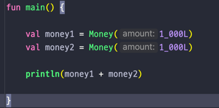

## Lec 04. 코틀린에서 연산자를 다루는 방법

### 1. 단항 연산자 / 산술 연산자
### 2. 비교 연산자와 동등성, 동일성
### 3. 논리 연산자 / 코틀린에 있는 특이한 연산자
### 4. 연산자 오버로딩

---

## 1. 단항 연산자 / 산술 연산자
- 단항 연산자
  - ++, --
- 산술 연산자
  - +, -, *, /, %
- 산술대입 연산자
  - +=, -=, *=, /=, %=
=> Java 와 Kotlin 완전 동일

## 2. 비교 연산자와 동등성, 동일성
- 비교 연산자
- <, >, <=, >=
=> Java 와 Kotlin 사용법 동일 단! Java 와 다르게 객체 비교시 비교연산자 사용시 자동으로 compareTo 호출

- 동등성(Equality) : 두 객체의 값이 같은가? 
- 동일성(Identity) : 완전히 동일한 객체인가?! 즉 주소가 같은가? 
    - Java : 동일성에 ==, 동등성에 equals() 를 사용
    - Kotlin : 동일성에 ===, 동등성에 == 를 사용 (== 사용시 간접적으로 equals() 호출)

## 3. 논리 연산자 / 코틀린에 있는 특이한 연산자
- 논리 연산자
  - &&, ||, !
=> Java 와 완전히 동일, Java 처럼 Lazy 연산을 수행
  - Lazy 연산 : a || b 일 경우 a 가 참이면 a 만 실행되고 b 는 실행되지 않는 것

- 코틀린에 있는 특이한 연산자
  - in / !in
    - 컬렉션이나 범위에 포함되어 있다. 포함되어 있지 않다.
  - a..b
    - a 부터 b 까지의 범위 객체를 생성한다
    - <코틀린에서 반복문을 다루는 방법> 강의에서 다룬다!
  - a[i]
    - a 에서 특정 index i 로 값을 가져온다  
  - a[i] = b
    - a 의 특정 index i 에 b 를 넣는다

## 4. 연산자 오버로딩
-  코틀린에서는 객체마다 연산자를 직접 정의할 수 있다.
-  
- 위의 사진 처럼 Money 클래스에 operator plus 연산자를 오버로딩하여 직접 정의하면 main 에서는 그냥 + 를 사용하였을때 알아서 저 plus 함수가 호출된다!

---

## 총 정리

- 단항연산자, 산술연산자, 산술대입연산자 Java 와 똑같다
- 비교 연산자 사용법도 Java 와 똑같다
  - 단, 객체끼리도 자동 호출되는 compareTo 를 이용해 비교 연산자를 사용할 수 있다.
- in, !in / a..b/ a[i] / a[i] = b 와 같이 코틀린에서 새로 생긴 연산자도 있다.
- 객체끼리의 연산자를 직접 정의할 수 있다.
