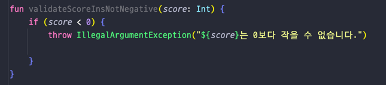

## Lec 05. 코틀린에서 조건문을 다루는 방법

### 1. if 문
### 2. Expression 과 Statement
### 3. switch 와 when

---

## 1. if 문

- Java 와 다른점
  - 함수에서 Unit(void)이 생략됨
  - 함수를 만들 때 fun 을 사용
  - exception 을 던질때 new 를 사용하지 않았다
=> Java 와 완전 똑같다.

## 2. Expression 과 Statement
- Java 에서 if-else 는 Statement 이지만, 
- Kotlin 에서는 Expression 이다.

- Statement : 프로그램의 문장, 하나의 값으로 도출되지 않는다
- Expression : 하나의 값으로 도출되는 문장
=> Statement 중에 하나의 값으로 도출되는 문장이 Expression 이다
=> 따라서 Statement 는 Expression 을 포함하고 있는 포함관계이다

- 마치 3항 연산자를 통해서 바로 값을 계산해서 return 하는 것처럼 코틀린은 if-else를 바로 리턴가능하다.(java 는 불가능)
- 코틀린에선 if-else 를 Expression 으로 사용할 수 있기 때문에 3항 연산자가 없다.

#### TIP 
- 어떠한 값이 특정 범위에 포함되어 있는지, 포함되어 있지 않은지 확인할 때 
  - Java = ``` if (0 <= score && score <= 100) {}```
  - Kotlin = ```if (score in 0..100) {}```

## 3. switch 와 when
- Kotlin 에서는 switch 대신에 when 을 사용한다.
  - ```
      when (값) {
        조건부 -> 어떠한 구문
        조건부 -> 어떠한 구문
        else -> 어떠한 구문 
      }
    ```
    - 조건부에는 어떠한 Expression 이라도 들어갈 수 있다(ex: is Type)(is = instanceof)

- Kotlin 에서는 score 에 특정 값만을 딱 지정해서 분기를 칠 수 있는게 아니라 다양한 조건을 가지고 분기를 칠 수 있다.
- when 은 Enum Class 혹은 Sealed Class 와 함께 사용할 경우, 더욱더 진가를 발휘한다.

---

## 총정리
- if / if - else / if - else if - else 모두 Java 와 문법이 동이랗다
- 단 Kotlin 에서는 Expresiion 으로 취급된다.
  - 때문에 Kotlin 에서는 삼항 연산자가 없다.
- Java 의 switch 는 Kotlin 에서 when 으로 대체되었고, when 은 더 강력한 기능을 갖는다.
