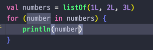
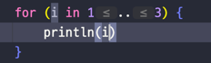
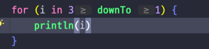
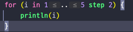

## Lec 06. 코틀린에서 반복문을 다루는 방법

### 1. for-each 문 (향상된 for문)
### 2. 전통적인 for 문
### 3. Progression 과 Range
### 4. while 문

---

## 1. for each 문
- 숫자가 들어 있는 리스트를 하나씩 출력하는 예제
- Java 와 차이점

  - 컬렉션을 만드는 방법이 다르다
  - : 대신 in 사용
  - in 뒤에는 Java 와 동일하게 Iterable 이 구현된 타입이라면 모두 들어갈 수 있다.
  
## 2. 전통적인 for 문

- i 의 범위를 나타낼때 in 을 사용


- i 의 값이 내려가는 경우 downTo 를 사용


- i 의 값이 1 이상 올라가는 경우 "step 오르는 숫자" 이런식으로

## 3. Progression(등차수열) 과 Range
- 동작 원리
  - .. 연산자: 범위를 만들어 내는 연산자
    - ex) 1..3: 1부터 3의 범위
    - IntProgression 을 상속받은 IntRange 클래스가 실제로 있고 그게 .. 이다
    - Progression(등차수열) 
      1. 시작 값
      2. 끝 값
      3. 공차
      - 예시
        - ```3 downTo 1``` : 시작값 3, 끝값 1, 공차 -1인 등차수열
        - ```1..5 step 2``` : 시작값 1, 끝값 5, 공차 +2인 등차수열
      - downTo, step 도 함수이다!(중위 호출 함수)
        - 변수.함수이름(argument) 대신 => 변수 함수이름 argument
          - ```1..3 step 2```
          - 1..5: 1 ~ 5 까지 공차가 1인 등차수열 생성
          - 1..5 step 2: 등차수열.step(2) 와 같은 효과 코틀린에서는 변수 함수이름 argument 이런식으로 작성
            - 1..5: 변수
            - step: 함수이름
            - 2: argument
          - 결론 : 1부터 5까지 공차가 2인 등차수열 => 1, 3, 5
  - 요약
    - Kotlin 에서 전통적인 for 문은 등차수열을 이용한다!
  
## 4. While 문
- Java 와 똑같다
- do while 도 동일

---

## 총 정리
- for each 문에서 Java 는 : , Kotlin 은 in 을 사용한다
- 전통적인 for 문에서 Kotlin 은 등차수열과 in 을 사용한다
- 그 외의 for 문 문법은 모두 동일하다
- while 문과 do while 문은 더욱더 놀랍도록 동일하다
