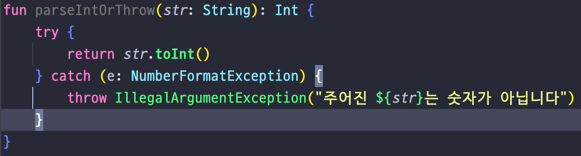
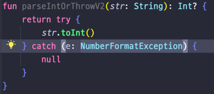
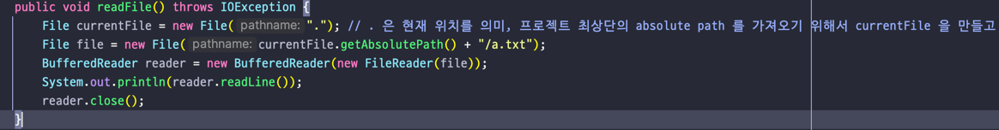
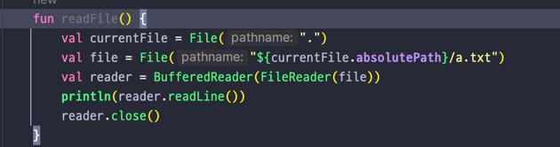
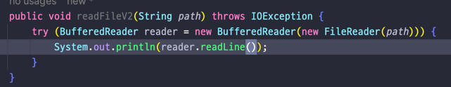
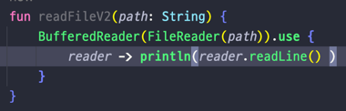

## Lec 07. 코틀린에서 예외를 다루는 방법

### 1. try catch finally 구문
### 2. Checked Exception 과 Unchecked Exception
### 3. try with resources

---

## 1. try catch finally 구문
- 주어진 문자열을 정수로 변경하는 예제

  - 기본타입간의 형변환은 toType() 을 사용
  - 타입이 뒤에 위치하고 new 를 사용하지 않음
  - 포맷팅이 간결함
- 주어진 문자열을 정수로 변경하는 예제 실패시 null 반환

  - 코틀린에선 try catch 도 하나의 Expression 으로 간주되어 try catch 에서 나온 최종 결과물을 한번만 리턴
- try catch finally 도 Java 랑 동일

## 2. Checked Exception 과 Unchecked Exception
- 프로젝트 내 파일의 내용물을 읽어오는 예제
- Java

- Kotlin

- Kotlin 에서는 Checked Exception 과 Unchecked Exception 을 구분하지 않는다.
- 모두 Unchecked Exception 이다.
- 따라서 위의 코드에서 Kotlin 은 IOException 을 따로 throws 로 던져주지 않아도 된다!

## 3. try with resources
- 프로젝트 내 파일의 내용물을 읽어오는 예제

- Java

- Kotlin(코틀린에는 try with resources 구문이 없다)

  - Kotlin 에서 제공하는 use 라는 함수를 사용한다.

---

## 총 정리

- try catch finally 구문은 문법적으로 완전히 동일하다
  - Kotlin 에서는 try catch 가 expression 이다.(return 을 한번만 해도 됨)
- Kotlin 에서 모든 예외는 Unchecked Exception 이다.
- Kotlin 에서는 try with resources 구문이 없다. 대신 코틀린의 언어적 특징을 활용해 close 를 호출해준다.

