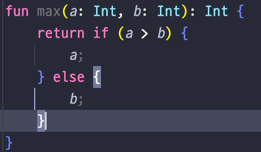
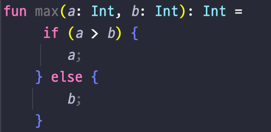
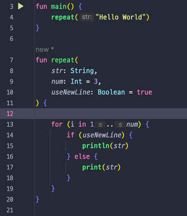
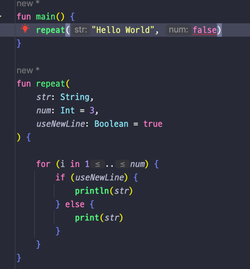
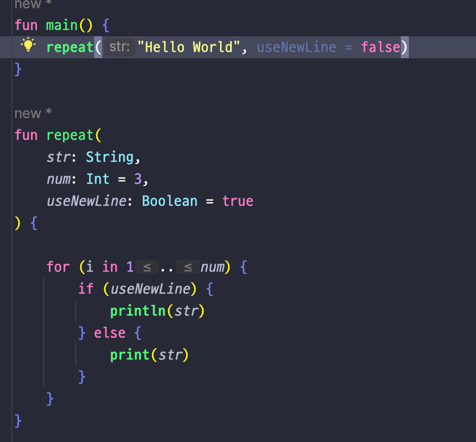
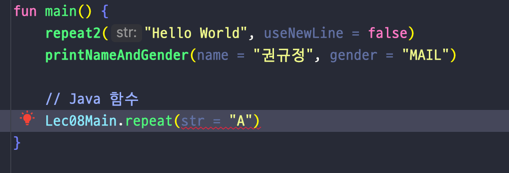
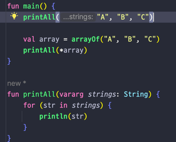

## Lec 08. 코틀린에서 함수를 다루는 방법

### 1. 함수 선언 문법
### 2. default parameter
### 3. named argument (parameter)
### 4. 같은 타입의 여러 파라미터 받기(가변인자)

---

### 1. 함수 선언 문법


- 리턴해주는 값이 하나라면 이렇게 중괄호를 없애고 = 으로 대체할 수 있다


- 한 줄로 변경 가능
- 결과 값이 a 나 b 즉 어떤 경우건 Int 타입을 반환하기 때문에 타입 생략 가능(단 "=" 을 사용하는 경우)
- 심지어 중괄호도 간단한 경우 생략 가능
- 만약 block {} 을 사용하는 경우에는 반환 타입이 Unit 이 아니면 명시적으로 작성해야한다.


- 함수는 클래스 안에 있을 수도, 파일 최상단에 있을 수도 있다 
- 또한 한 파일 안에 여러 함수들이 있을 수도 있다.


## 2. default parameter

- Java 는 기본값을 넣고싶은 경우 오버로딩을 사용해서 기본값을 설정한다
- 하지만 코틀린은 밖에서 파라미터를 넣지 않을 경우 기본값을 함수의 매개변수에 설정해서
- 오버로딩의 효과를 볼 수 있다 
- 물론 코틀린도 Java 처럼 오버로딩, 오버로드 기능이 있다.

## 3. named argument (parameter)

- 사진처럼 매개변수가 3개인 함수에 두번째만 default parameter 를 사용하고 첫번째 세번째에 값을 넣으려 할 경우 에러가 발생한다


- 그럴땐 매개변수 이름을 직접 지정해서 값을 넣어주고 지정되지 않은 매개변수는 기본값이 사용되도록 할 수 있다
- 장점 : builder 를 직접 만들지 않고 builder 의 장점을 가지게 된다.
  - 같은 타입의 매개변수에 실수하지 않고 값을 지정해서 넣을 수 있다.
- 코틀린에서 Java 함수를 가져다 사용할 때는 named argument 를 사용할 수 없다.



## 4. 같은 타입의 여러 파라미터 받기(가변인자)

- 코틀린에서는 ...을 타입 뒤에 쓰는 대신 제일 앞에 vararg 를 적어줘야 한다!
- 배열을 바로 넣는 대신 스프레드 연산자(*)를 분ㅌ여주어야 한다.
- 하지만 , 로 구분해서 넣는건 그냥 넣을 수 있다.

---

## 총 정리
- 함수의 문법은 Java와 다르다!
  - ``` 접근지시어 fun 함수이름(파라미터): 반환타입 {}```
- body 가 하나의 값으로 간주되는 경우 block 을 없앨 수도 있고,
  block 이 없다면 반환 타입을 없앨 수도 있다.
- 함수 파라미터에 기본값을 설정해줄 수 있다.
- 함수를 호출할때 특정 파라미터를 지정해 넣어줄 수 있다.
- 가변인자에는 vararg 키워드를 사용하며, 가변인자 함수를 배열과 호출할 때는 *을 붙여주어야 한다
