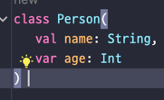
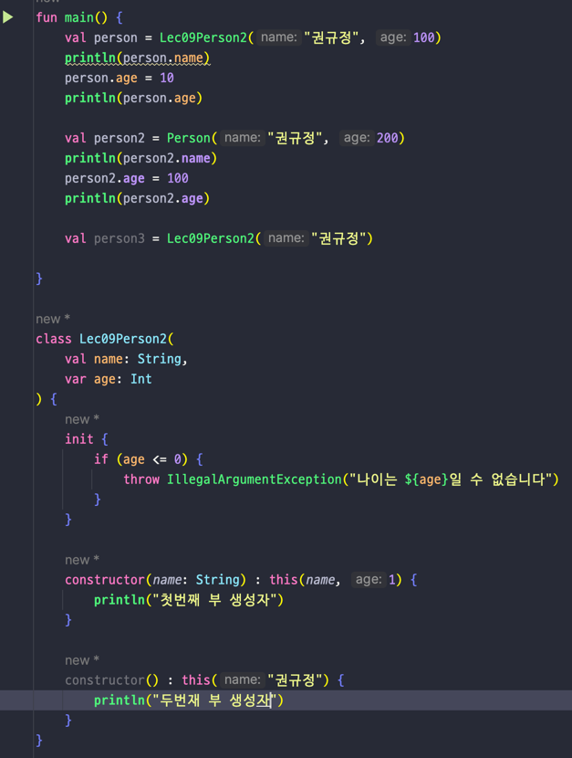
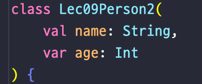
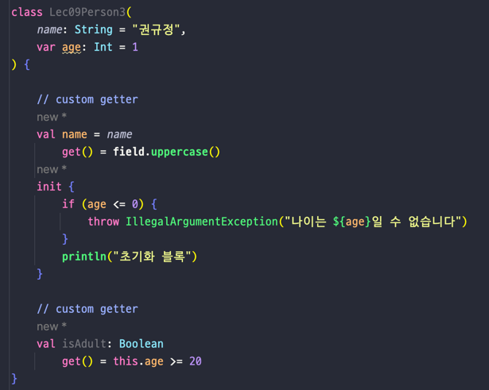
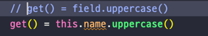
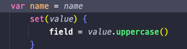

## Lec09. 코틀린에서 클래스를 다루는 방법

### 1. 클래스와 프로퍼티
### 2. 생성자와 init
### 3. 커스텀 getter, setter
### 4. backing field

---

## 1. 클래스와 프로퍼티

- 코틀린에서 생성자는 클래스 이름 옆에다 선언한다(원래는 constructor라는 지시어가 있지만 생략가능)
- 프로퍼티 = 필드 + getter + setter
- 코틀린에서는 필드만 만들면 getter, setter를 자동으로 만들어준다
- 심지어 코틀린은 생성자에서 프로퍼티를 만들 수 있다

- body 까지 없애면서 이렇게 까지 줄일 수 있다
- .필드를 통해 getter 와 setter 를 바로 호출한다
- Java 클래스에 대해서도 .필드로 getter 와 setter 를 쓸 수 있다.

## 2. 생성자와 init

- init : 클래스가 초기화되는 시점에 실행되는 블록
- 만약 생성자를 하나 더 만들고 싶다면 init 아래에 constructor(파라미터)를 선언해서 만든다
  - this(name, 1)은 위에있는 생성자를 호출
- 생성자
  - 주 생성자 
    - 
    - 만약 주 생성자의 파라미터가 하나도 없다면 생략 가능
  - 부 생성자
    - 
    - 없을 수도 있고 있을수도 있다 
    - 최종적으로 주 생성자를 this 로 호출해야한다.(중간에 부 생성자를 호출하는건 상관없음)
    - body 를 가질 수 있다
    - 본문은 역순으로 생성된다
    - 하지만 코틀린에선 부 생성자보단 default parameter 를 추천한다
    - Converting과 같은 경우 부생성자를 사용할 수 있지만 그보다는 정적 팩토리 메서드를 사용하자!
    - 사실상 쓸일이 거의 없음!!!!

## 3. 커스텀 getter, setter

- 커스텀 getter 
  - 마치 이 Person 클래스에 프로퍼티가 있는 것처럼 보여준다
  - 객체의 속성이라면, custom getter 그렇지 않으면 함수를 사용하자!
  - 커스텀 getter 를 사용하면 자기자신을 변형시킬 수 있다.
    - 위의 사진에서 name 의 custom getter 에 field 라는 예약어를 사용했는데 이것은 자기 자신을 가리키는 backing field 이다.
      - 하지만 custom getter 에서 backing field 는 잘 사용하지 않는다
      - 
- 커스텀 setter

- 하지만 Setter 자체를 지양하기도 하고 custom setter 도 잘 사용하지 않는다

---

## 총 정리
- 코틀린에서는 필드를 만들면 getter 와 (필요에 따라) setter 가 자동으로 생긴다
  - 때문에 이를 프로퍼티라고 부른다
- 코틀린에서는 주 생성자가 필수이다
- 코틀린에서는 constructor 키워드를 사용해 부생성자를 추가로 만들 수 있다.
  - 단 default parameter 나 정적 팩토리 메서드를 추천한다
- 실제 메모리에 존재하는것과 무관하게 custom getter 와 custom setter 를 만들 수 있다.
  - 실제 메모리에 존재하는것과 무관하게 = 함수로도 만들 수 있지만 프로퍼티 인것처럼 custom getter 를 만드는것
- custom getter, custom setter 에서 무한루프를 막기 위해 field 라는 키워드를 사용한다
  - 이를 backing field 라고 부른다

