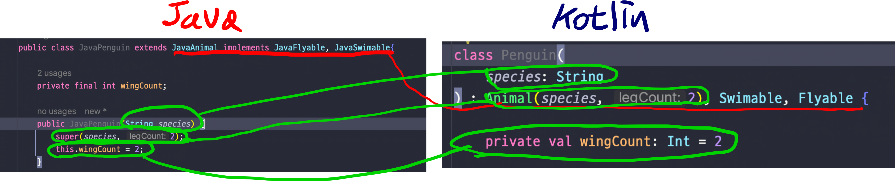
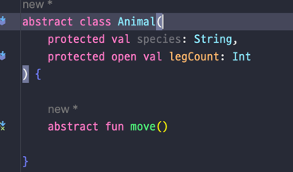
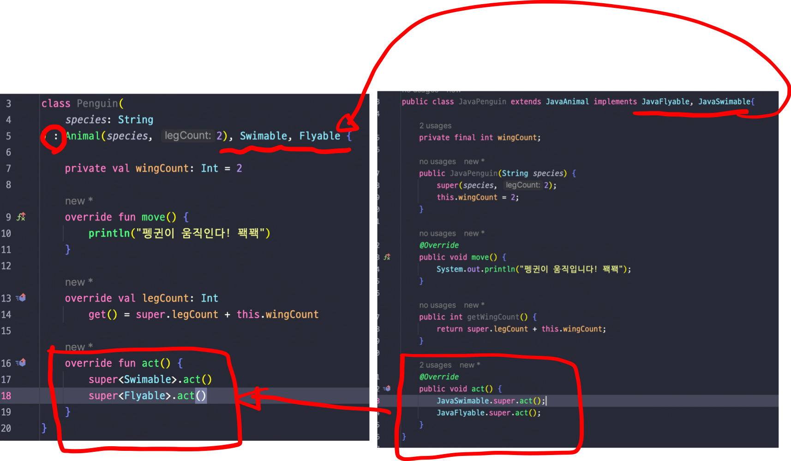
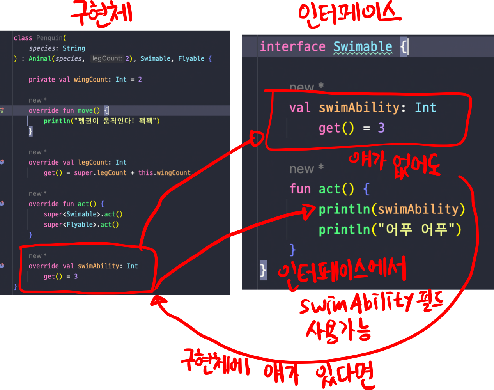
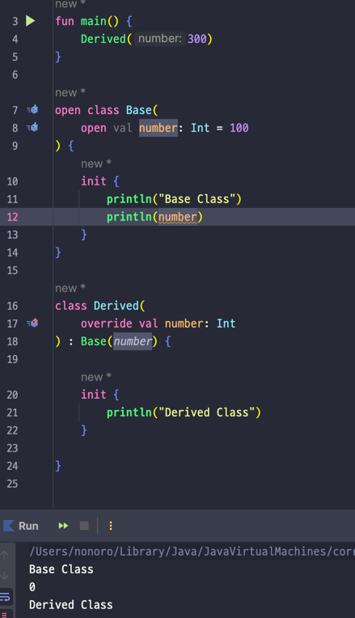

## Lec 10. 코틀린에서 상속을 다루는 방법

### 1. 추상 클래스
### 2. 인터페이스
### 3. 클래스를 상속할 때 주의할 점
### 4. 상속 관련 지시어 정리

---

## 1. 추상 클래스

- 코틀린에서는 추상 프로퍼티가 아니라면, 상속 받을때 open을 꼭 붙여야한다.
  - 여기서 추상 프로퍼티가 아니라는 말은 아래 사진에서 legCount에는 abstract 가 붙어있지 않기 때문에 추상프로퍼티가 아니므로 상속을 받기 위해 open 을 붙여줬다.
  - 추상클래스에서 자동으로 만들어진 getter를 override
  - java랑 똑같이 상위클래스에 접근하는 키워드는 super이다.

- 추상 클래스에 대한 java 와 코틀린의 공통점
  - java, kotlin 모두 추상 클래스는 인스턴스화 할 수 없다!

## 2. 인터페이스

- 인터페이스 구현도 : 을 사용한다 
- 중복되는 인터페이스를 특정할때는 super<타입>.함수 사용
- Java, Kotlin 모두 인터페이스를 인스턴스화 할 수 없다.
- Kotlin에서는 backing field가 없는 프로퍼티를 interface에 만들 수 있다.

- 결국 프로퍼티라는게 field라는 의미도 있지만 getter라는 의미도 있기 때문에 
- getter에 대한 default 메서드나 getter에 대한 추상메서드를 인터페이스에 만드는거라 
- backing field없는 프로퍼티를 인터페이스에 만들 수 있다.

## 3. 클래스를 상속받을때 주의할 점

- 위의 그림을 보면 number의 값이 0이 나온다
- 이유
  - 하위클래스인 Derived를 호출하면 
  - 먼저 상위클래스의 Base가 생성된다. 
  - 상위클래스는 하위클래스에서 number를 오버라이딩 했기 때문에 하위 클래스에 있는 number를 가져오게된다.
  - 그런데 아직 상위 클래스의 constructor가 먼저 실행된 단계라서 하위 클래스에 number라는 값에 초기화가 이루어지지 않았다.
  - 그때 하위 클래스의 number에 접근하려고 하니 아직 초기화되지않았기 때문에 int의 기본값인 0이 출력된것이다.
  - 따라서 상위 클래스의 constructor와 init에서는 하위 클래스에서 override하고 있는 field에 접근하면 안된다.
    - 정확히는 final이 아닌 프로퍼티에 접근하지말자!!
- 상위 클래스를 설계할 때 생성자 또는 초기화 블록에 사용되는 프로퍼티에는 open을 피해야 한다.

## 4. 상속 관련 지시어 정리
1. final: override를 할 수 없게 한다. default로 보이지 않게 존재한다.(생략되어있음 그래서 open을 붙이지 않으면 override를 할 수 없는 것!)
2. open: override를 열어 준다
3. abstract: 반드시 override를 해야 한다.
4. override: 상위 타입을 오버라이드 하고 있다.
   - Java에선 override를 어노테이션이기 때문에 반드시 붙이지 않아도 됐지만 Kotlin은 키워드로 붙기 때문에 필수!

---

## 총 정리
- 상속 또는 구현을 할 때에 : 을 사용해야 한다.
- 상위 클래스 상속을 구현할 때 생성자를 반드시 호출해야 한다.
- override를 필수로 붙여야 한다.
- 추상 멤버가 아니면 기본적으로 오버라이드가 불가능하다.(기본적으로 final이 생략되어 붙어있기 때문)
  - open을 사용해주어야한다.
- 상위 클래스의 생성자 또는 초기화 블록에서 open 프로퍼티를 사용하면 얘기지 못한 버그가 생길 수 있다.
