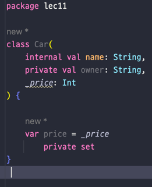

## Lec 11. 코틀린에서 접근 제어를 다루는 방법

### 1. 자바와 코틀린의 가시성 제어
### 2. 코틀린 파일의 접근 제어
### 3. 다양한 구성요소의 접근 제어
### 4. Java와 Kotlin을 함께 사용할 경우 주의할 점

---

## 1. Java와 코틀린의 가시성 제어

- 코틀린에서는 패키지를 namespace를 관리하기 위한 용도로만 사용! 가시성 제어에는 사용되지 않는다!
  - 애당초 패키지라는걸 접근 제어로 쓰지 않음! - 따라서 default 접근 제어자가 없음
- internal
  - 같은 모듈에서만 접근 가능
    - 모듈: 한 번에 컴파일되는 kotlin코드
      - IDEA Module
      - Maven Project
      - Gradle Source Set
      - Ant Task <kotlinc>의 호출로 컴파일 파일의 집합
    - 만약 상위 모듈과 하위 모듈이 있다면 하위 모듈에 internal이 붙어있을때 상위 모듈에서 하위 모듈을 가져오지 못함
- 정리
  - 코틀린에서는 패키지라는 개념을 접근 제어에 사용하지 않기 때문에
    - protected에서는 패키지가 빠지고 default는 아예 사라지고 대신에 모듈을 접근제어하는 기능이 생겼다.

- Java의 기본 접근 지시어는 default
- Kotlin의 기본 접근 지시어는 public 
- 코틀린은 .kt 파일에 변수, 함수, 클래스 여러개를 바로 만들 수 있다.

## 2. 코틀린 파일의 접근 제어

- protected 는 파일에는 사용 불가

## 3. 다양한 구성요소의 접근 제어
- 클래스, 생성자, 프로퍼티에 접근 지시어를 붙일 경우
### 클래스

### 생성자
- 생성자도 가시성 범위는 동일 단! 생성자에 접근지시어를 붙이려면 constructor를 써줘야한다.

- constructor를 붙이지 않고 그냥 기본 생성자에다가 붙이면 에러발생

- Java에서 유틸성 코드를 만들때 abstract class + private constructor를 사용해서 인스턴스화를 막았는데 
- kotlin도 가능 근데 kotlin은 파일 최상단에 작성

### 프로퍼티
- 프로퍼티도 가시성 범위는 동일하다
- 단 프로퍼티의 가시성을 제어하는 방법

- price의 setter에만 private로 접근제어를 주기

## 4. Java와 Kotlin을 함께 사용할 경우 주의할 점
- internal은 바이트 코드 상 public이 된다. 때문에 Java 코드에서는 Kotlin 모듈의 internal 코드를 가져올 수 있다.
  - 예시
    - 상위모듈이 Java 하위모듈이 Kotlin일 경우 하위 모듈의 internal에 감싸진 field나 함수 등을 상위 모듈인 자바에선 가져올 수 있다.
- Kotlin의 protected와 Java의 protected는 다르다 Java는 같은 패키지의 Kotlin protected 멤버에 접근할 수 있다.

---

## 총 정리

- Kotlin에서 패키지는 namespace 관리용이기 때문에 protected는 의미가 달라졌다
- Kotlin에서는 default가 사라지고 모듈간의 접근을 통제하는 internal이 새로 생겼다
- 생성자에 접근 지시어를 붙일 때는 constructor를 명시적으로 써주어야 한다.
- 유틸성 함수를 만들 때는 파일 최상단을 이용하면 편리하다
- 프로퍼티의 custom setter에 접근 지시어를 붙일 수 있다.
- Java에서 Kotlin코드를 사용할 때 internal과 protected는 주의해야 한다.

