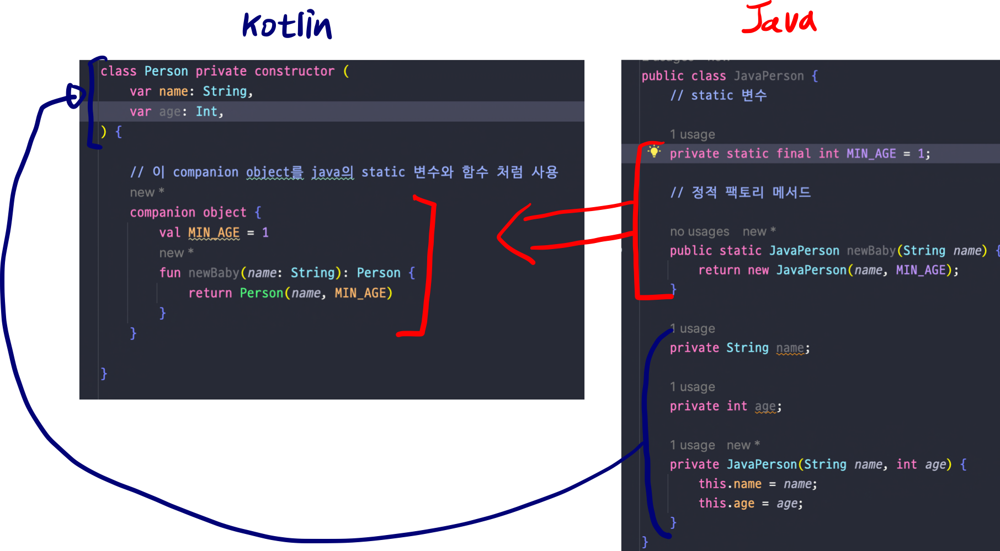
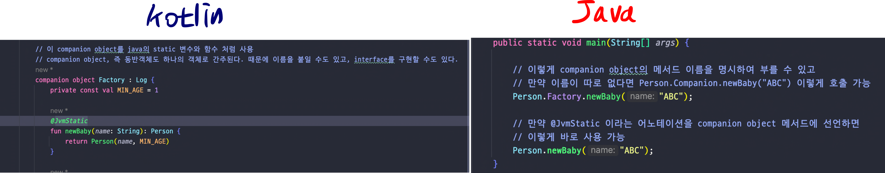
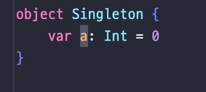
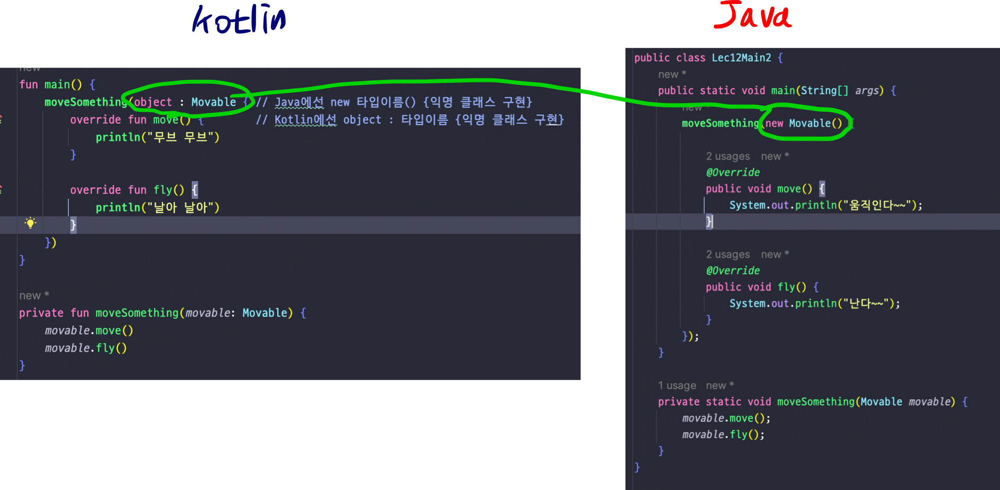

## Lec12. 코틀린에서 object 키워드를 다루는 방법

### 1. static 함수와 변수
### 2. 싱글톤
### 3. 익명 클래스

---

## 1. static 함수와 변수

- kotiln은 static 대신 companion object를 사용한다
  - static: 클래스가 인스턴스화 될 때 새로운 값이 복제되는게 아니라 정적으로 인스턴스끼리의 값을 공유
  - companion object: 클래스와 동행하는 유일한 오브젝트 

- val과 const의 차이
  - val: 해당 변수의 값이 런타임시에 할당된다
  - const val: 해당 변수의 값이 컴파일시에 할당된다.

**- 따라서 const는 진짜 상수에 붙이기 위한 용도(기본타입과 String에 붙일 수 있음)**
- companion object, 즉 동반객체도 하나의 객체로 간주된다. 때문에 이름을 붙일 수도 있고, interface를 구현할 수도 있다.
- companion object에 유틸성 함수들을 넣어도 되지만 최상단 파일을 활용하자!

- 자바에서 코틀린 필드의 static함수 또는 static필드를 사용하고 싶은 경우

  - @JvmStatic을 사용하고자 하는 companion object의 메서드에 선언한다.
  - companion object에 이름이 있다면 이름을 없다면 기본인 Companion을 붙인다
    - 클래스이름.Companion object 이름.메서드명 or 클래스이름.Companion.메서드명

## 2. 싱글톤

- 이렇게 선언만 해주면 끝이다
- 하지만 직접적으로 사용하는 일은 많이 없다

## 3. 익명 클래스

- Java에선 new 타입이름() {익명 클래스 구현} 
- Kotlin에선 object : 타입이름 {익명 클래스 구선}

---

## 총 정리
- Java의 static 변수와 함수를 만드려면 Kotlin에서는 companion object를 사용해야 한다.
- companion object도 하나의 객체로 간주되기 때문에 이름을 붙일 수 있고, 다른 타입을 상속받을 수 있다.
- Kotlin에서 싱글톤 클래스를 만들 때 object 키워드를 사용한다.
- Kotlin에서 익명 클래스를 만들 때 object : 타입을 사용한다.

