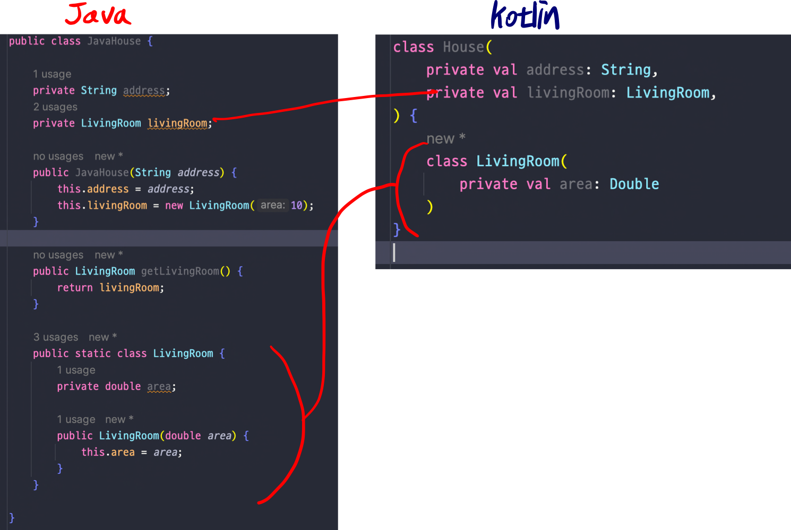
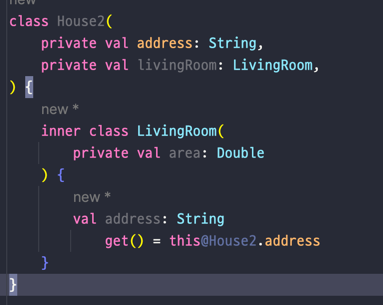
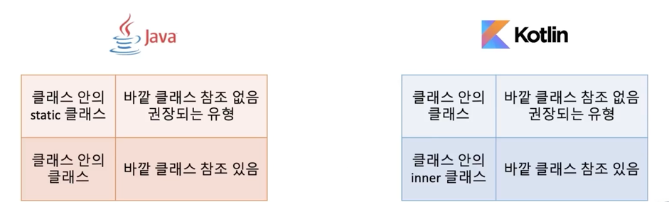

## Lec 13. 코틀린에서 중첩 클래스를 다루는 방법

### 1. 중첩 클래스의 종류
### 2. 코틀린 중첩 클래스와 내부 클래스

---

## 1. 중첩 클래스의 종류
1. static을 사용하는 중첩 클래스
  - 클래스 안에 static을 붙인 클래스! 밖의 클래스 직접 참조 불가
2. static을 사용하지 않는 중첩 클래스
  - 내부 클래스(Inner Class)
    - 클래스 안의 클래스, 밖의 클래스 직접 참조 가능
  - 지역 클래스(Local Class)
    - 메서드 내부에 클래스를 정의
  - 익명 클래스(Anonymous Class)
    - 일회성 클래스

- 보통 중첩 클래스는 1번과 2번의 내부 클래스를 지칭

## 2. 코틀린 중첩 클래스와 내부 클래스
- Java의 static 중첩 클래스 (권장되는 클래스 안의 클래스)

  - kotlin에서는 기본적으로 바깥 클래스에 대한 연결이 없는 중첩 클래스가 만들어진다 따라서 그냥 class를 선언해서 쓰면된다.

- Java의 static 중첩 클래스 (권장되지 않는 클래스 안의 클래스)

  - 바깥클래스 참조를 위해 this@바깥클래스를 사용한다.   
  - 코틀린에서는 기본적으로 바깥 클래스를 참조하지 않지만 바깥 클래스를 참조하고 싶다면 inner 키워드를 추가한다.

---

## 총 정리
- 클래스 안에 클래스가 있는 경우 종류는 두 가지가 있다.
  - 클래스 안에 기본 클래스를 사용하고 바깥 클래스에 대한 참조가 없고
  - 바깥 클래스를 참조하고 싶다면 inner 키워드를 붙여야 한다.
- 코틀린 inner class에서 바깥 클래스를 참조하려면 this@바깥클래스를 사용해야 한다.

