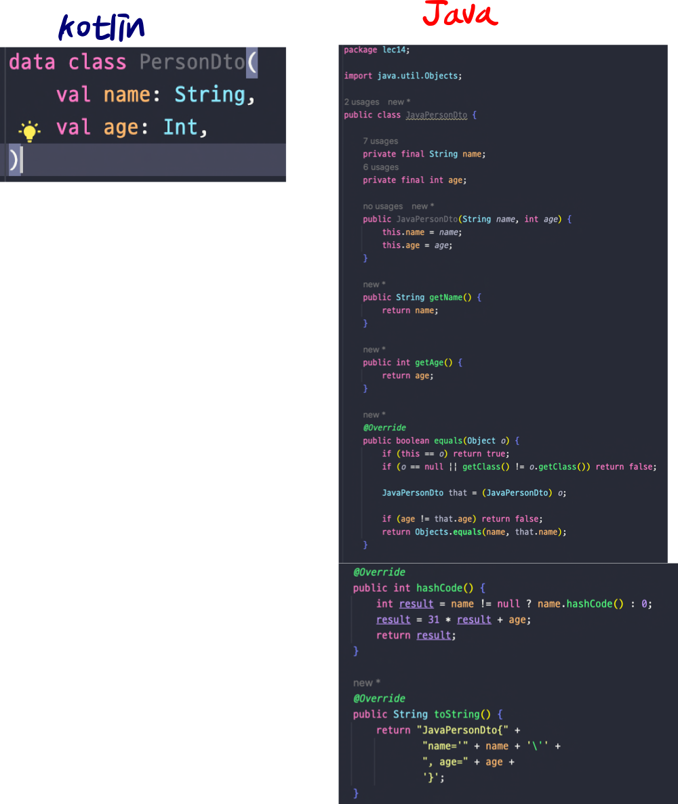
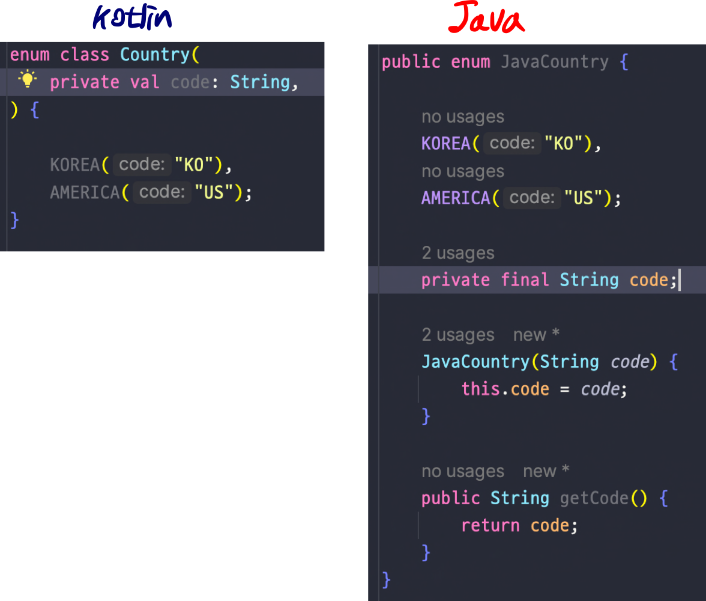
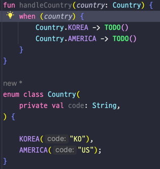
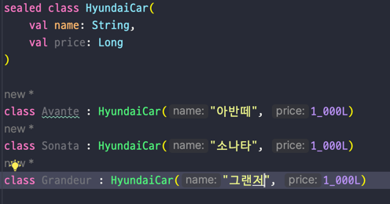

## Lec 14. 코틀린에서 다양한 클래스를 다루는 방법

### 1. Data class
### 2. Enum Class
### 3. Sealed Class, Sealed Interface

---

## 1. Data Class

- kotlin은 data 키워드를 붙여주면 equals, hashCode, toString을 자동으로 만들어줍니다!
- named argument까지 활용하면 builder pattern을 쓰는 것 같은 효과도 있다.
- 사실상 builder, equlas, hashCode, toString이 모두 있는것!
- Java에서는 JDK16부터 Kotlin의 data class 같은 record class를 도입

## 2. Enum Class
- 추가적인 클래스를 상속받을 수 없다. 인터페이스는 구현할 수 있으며, 각 코드가 싱글톤이다.

- when은 Enum Class 혹은 Sealed Class와 함께 사용할 경우, 더욱더 진가를 발휘한다.

  - 컴파일러가 country의 모든 타입을 알고 있어 다른 타입에 대한 로직(else)을 작성하지 않아도 된다.
  - Enum에 변화가 있으면 알 수 있다.

## 3. Sealed Class, Sealed Interface
- sealed 봉인을 한
- 용도: 상속이 가능하도록 추상클래스를 만들까 하는데... 외부에서는 이 클래스를 상속받지 않았으면 좋겠어!!
- 따라서 sealed로 하위 클래스를 봉인하자!
- sealed 클래스
  - 컴파일 타임 때 하위 클래스의 타입을 모두 기억한다. 즉 런타임때 클래스 타입이 추가될 수 없다.
  - 하위 클래스는 같은 패키지에 있어야 한다.
- Enum과 다른 점
  - 클래스를 상속받을 수 있다.
  - 하위 클래스는 멀티 인스턴스가 가능하다.

- 컴파일 타임 때 하위 클래스의 타입을 모두 기억한다. 즉 런타임때 클래스 타입이 추가될 수 없다.
- 실제로 추상화가 필요한 Entity or DTO에 sealed class를 활용

---

## 총 정리
- Kotlin의 Data class를 사용하면 equals, hashCode, toString을 자동으로 만들어준다.
- Kotlin의 Enum Class는 Java의 Enum Class와 동일하지만, when과 함께 사용함으로써 큰 장점을 갖게 된다.
- Enum Class보다 유연하지만, 하위 클래스를 제한하는 Sealed Class 역시 when과 함께 주로 사용된다.
