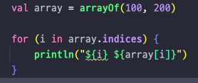
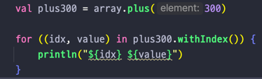
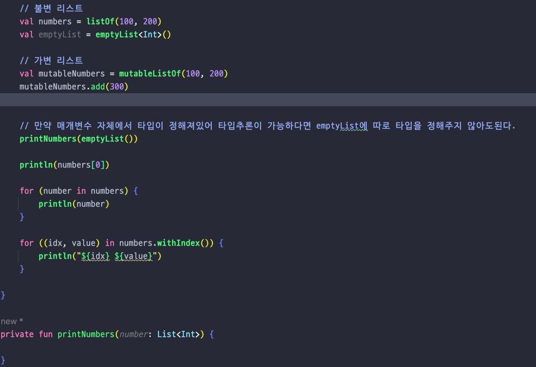
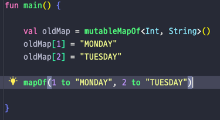
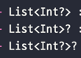

## Lec 15. 코틀린에서 배열과 컬렉션을 다루는 방법

### 1. 배열
### 2. 코틀린에서의 Collection - List, Set, Map
### 3. 컬렉션의 null 가능성, Java와 함께 사용하기

---

## 1. 배열
- 배열을 잘 사용하지 않는다 되도록이면 List를 사용하자!

- array.indices는 0부터 마지막 index까지의 Range이다

- withIndex()를 사용하면, 인덱스와 값을 한 번에 가져올 수 있다.
- plus로 배열에 값을 쉽게 추가하여 값이 추가된 새로운 배열을 얻을 수 있다.

## 2. 코틀린에서의 Collection
- 컬렉션을 만들어줄 때 불변인지, 가변인지를 설정해야 한다.
  - 가변 (Mutable) 컬렉션: 컬렉션에 element를 추가, 삭제할 수 있다.
  - 불변 컬렉션: 컬렉션에 element를 추가, 삭제할 수 없다. (listOf, mapOf등의 정적 팩토리 메소드는 불변이다)
    - Collection을 만들자 마자 Colletions.unmodifiableList() 등을 붙여준다!
    - 불변 컬렉션이라 하더라도 Reference type인 Element의 필드는 바꿀 수 있다.
      - 컬렉션 자체에 element를 추가할 순 없지만 만약 element가 객체라면 그 객체 안에 있는 요소는 바꿀 수 있다.

- List

- 가변 리스트를 만들때 비어있는 리스트를 만들어주는 경우 <> 로 타입을 명시해야 하지만 타입추론이 가능한 경우는 안해줘도 된다.(보통 인수로 넣는 경우)
- 불변 리스트는 mutableListOf로 만들 수 있으며 값을 추가하는 것은 자바와 똑같이 add로 추가한다.
- 우선은 불변 리스트를 만들고 필요한 경우 가변 리스트로 바꾸자!

- Set
  - 집합(Set)은 List와 다르게 순서가 없고, 같은 element는 하나만 존재할 수 있다.
  - 자료구조적 의미만 제외하면 모든 기능이 List와 비슷하다.
  - 기본적인 구현체는 LinkedHashSet이다.
  - 가변집합을 만들고 싶다면 mutableSetOf()
    
- Map

- Kotlin도 동일하게 MutableMap을 만들어 넣을 수도 있고 정적 팩토리 메소드를 바로 활용할 수도 있다.
- mutableMapOf는 가변 Map이기 때문에 (key, value)를 넣을 수 있다.
- Java처럼 put을 쓸 수도 있고 map[key] = value 을 쓸 수도 있다.
- mapOf(key to value)를 사용해 불변 map을 만들 수 있다.

## 3. 컬렉션의 null 가능성, Java와 함께 사용하기

- List<Int?> : 리스트에 null이 들어갈 수 있지만, 리스트는 절대 null이 아님
- List<Int>? : 리스트에는 null이 들어갈 수 없지만, 리스트는 null일 수 있음
- List<Int?>? : 리스트에 null이 들어갈 수도 있고, 리스트 자체가 null일 수도 있음
- ? 위치에 따라 null가능성 의미가 달라지므로 차이를 잘 이해하자!

- Java는 읽기 전용 컬렉션과 변경 가능 컬렉션을 구분하지 않는다.
  - 따라서 Java에서는 코틀린의 불변 컬렉션을 가지고가서 그냥 element를 추가하게 된다 그렇게 되면 코틀린에서 에러가 발생
- Java는 nullable 타입과 non-nullable 타입을 구분하지 않는다.
  - 이 경우도 코틀린에선 null이 없다고 가정하고 만든 non-nullable List를 Java에선 모르기 때문에 그냥 null로 초기화 할 경우 코틀린에서 에러가 발생 
- 위의 두가지 문제에 대한 해결책
  - 코틀린 쪽의 컬렉션이 Java에 호출되면 컬렉션 내용이 변할 수 있음을 감안해서 방어로직을 짜기
  - 코틀린 쪽에서 Collections.unmodifableXXX()를 활용하여 변경 자체를 막기

- Kotlin에서 Java 컬렉션을 가져다 사용할때 플랫폼 타입을 신경써야 한다.

- 만약 Java에서 List를 코틀린으로 보냈는데 코틀린에선 List가 위의 사진의 3개중 어떤 타입인지 알 수 없다
  - 따라서 Java 코드를 보며 맥락을 확인하고 Java 코드를 가져오는 지점을 wrapping한다.

---

## 총 정리
- 배열의 사용법이 약간 다르다.
- 코틀린에서는 컬렉션을 만들 때도 불변/가변을 지정해야 한다.
- List, Set, Map 에 대한 사용법이 변경, 확장되었다.
- Java와 Kotlin 코드를 섞어 컬렉션을 사용할 때에는 주의해야 한다.
  - Java에서 Kotlin 컬렉션을 가져갈 때는 불변 컬렉션을 수정할 수도 있고, non-nullable 컬렉션에 null을 넣을 수도 있다.
  - Kotlin에서 Java 컬렉션을 가져갈 때는 플랫폼타입을 주의해야 한다.
  - 

