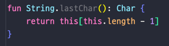
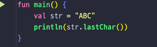
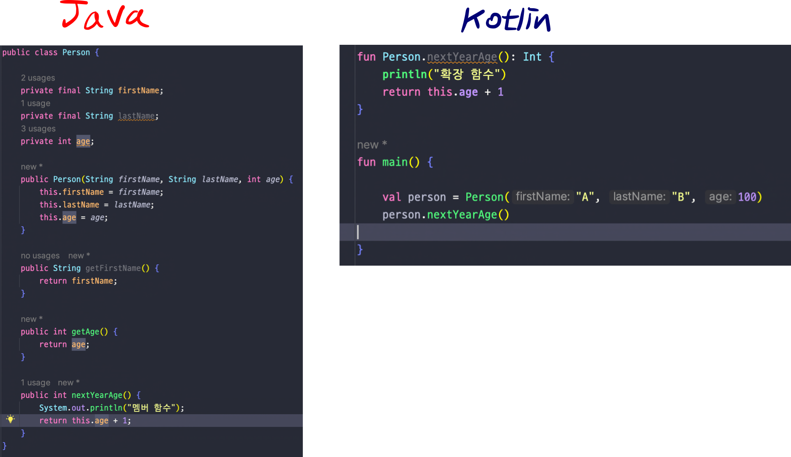
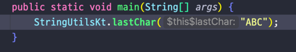
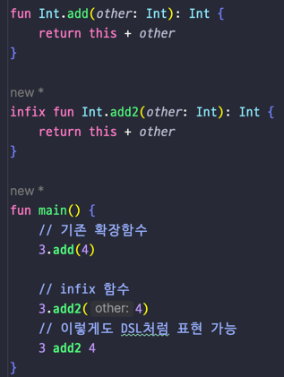
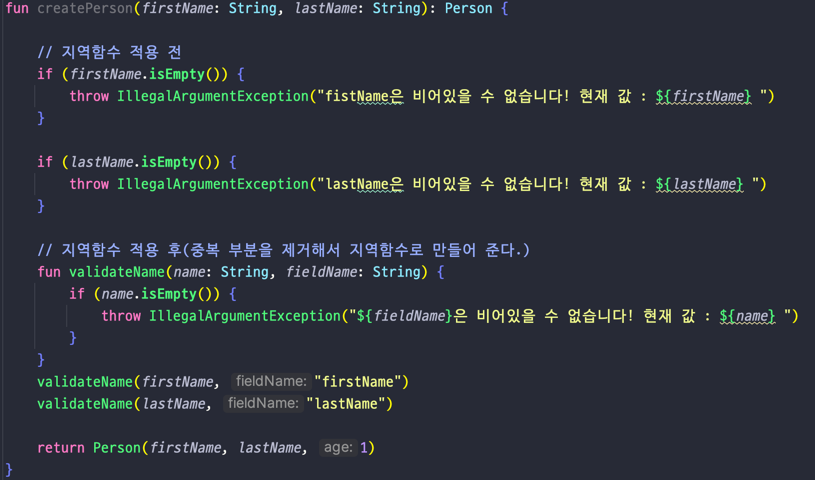

## Lec 16. 코틀린에서 다양한 함수를 다루는 방법

### 1. 확장함수
### 2. infix 함수(중위함수)
### 3. inline 함수
### 4. 지역함수

---

## 1. 확장함수
- 기존 Java 코드 위에 자연스럽게 코틀린 코드를 추가하기 위해서 만들어진 함수.
- Java로 만들어 라이브러리를 유지보수, 확장할 때 Kotlin 코드를 덧 붙이게 해준다.
- 어떤 클래스안에 있는 메서드처럼 호출할 수 있지만, 함수는 밖에 만들 수 있게 하자.

- 확장함수
- String을 확장
- 함수 안에서는 this를 통해 불려진 인스턴스에 접근이 가능하다.
```
fun 확장하려는클래스.함수이름(파라미터): 리턴타입 {
    // this를 이용해 실제 클래스 안의 값에 접근
    // this == 수신 객체
    // 확장하려는 클래스 == 수신객체 타입
}
```
- 확장함수 호출 예시


- 원래 String에 있는 멤버함수 처럼 사용할 수 있다.

- 그런데 만약 확장함수가 public이고, 확장함수에서 수신객체클래스의 private 함수를 가져오면 캡슐화가 깨지는게 아닌가?!
  - 그래서 애당초 확장함수 에서는 클래스에 있는 private 또는 protected 멤버를 가져올 수 없다.

- 멤버함수와 확장함수의 시그니처가 같다면?

  - 멤버함수가 우선적으로 호출된다.
  - 그래서 확장함수를 먼저 만들었지만, 추후에 다른 기능의 똑같은 멤버함수가 생기면 오류가 발생할 수 있다 주의!!!!!!!!

- 확장함수가 오버라이드 된다면?
  - 해당 변수의 현재 타입 즉, 정적인 타입에 의해 어떤 확장함수가 호출될지 결정된다.
    - 부모 자식 관계에서 자식에 부모의 확장함수가 오버라이드 되있는 경우
    - 부모타입으로 선언된 경우 부모 or 자식의 인스턴스를 받는 경우에 부모의 확장함수가 호출된다
    - 자식타입으로 선언된 경우 자식 인스턴스를 받는 경우 오버라이드 된 자식의 확장함수가 호출된다.
  
### 중간 정리
1. 확장함수는 원본 클래스의 private, protected 멤버 접근이 안된다!
2. 멤버함수, 확장함수 중 멤버함수에 우선권이 있다.
3. 확장함수는 현재 타입을 기준으로 호출된다.

- Java에서 Kotlin 확장함수를 가져다 사용할 수 있을까?
  - 정적 메서드를 부르는 것처럼 사용 가능하다.
  

- 확장함수 라는 개념은 확장프로퍼티와도 연결된다.
  - 확장 프로퍼티의 원리 = 확장함수 + custom getter

## 2. infix 함수
- 중위함수, 함수를 호출하는 새로운 방법!!
- downTo, step 도 함수이다! (중위 호출 함수)
- 호출 방법
  - 변수.함수이름(argumen) 대신 => 변수 함수이름 argument


## 3. inline 함수
- 함수가 호출되는 대신, 함수를 호출한 지점에 함수 본문을 그대로 복붙하고 싶은 경우!
- inline 함수를 사용하는 이유
  - 함수를 파라미터로 전달할 때에 오버헤드를 줄일 수 있다.
  - 하지만 inline 함수의 사용은 성능 측정과 함께 신중하게 사용되어야 한다.

## 4. 지역함수
- 함수 안에 함수를 선언할 수 있다.
- 함수로 추출하면 좋을 것 같은데 이 함수를 직즘 함수 내에서만 사용하고 싶을 때 사용한다!
- 하지만 depth가 깊어지기도하고 코드가 그렇게 깔끔하지도 않으므로 차라리 Person 클래스에서 검증하는게 더 낫다
- 잘 안씀


---

## 총 정리
- Java 코드가 있는 상황에서, Kotlin 코드로 추가 기능 개발을 하기 위해 확장함수와 확장프로퍼티가 등장했다.
  ```
    fun 확장하려는클래스.함수이름(파라미터): 리턴타임 {
      // this를 이용해 실제 클래스 안의 값에 접
    }
  ```
- 확장함수는 원본 클래스의 private, protected 멤버 접근이 안된다!
- 멤버함수, 확장함수 중 멤버함수에 우선권이 있다.
- 확장함수는 현재 타입을 기준으로 호출된다. 
- Java에서는 static 함수를 쓰는것처럼 Kotlin의 확장함수를 쓸 수 있다.
- 함수 호출 방식을 바꿔주는 infix 함수가 존재한다.
  - a 함수이름 b
- 함수를 복사-붙여넣기 하는 inline 함수가 존재한다.
- Kotlin에서는 함수 안에 함수를 선언할 수 있고, 지역함수라고 부른다
