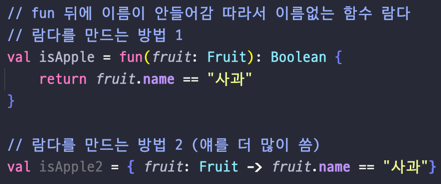
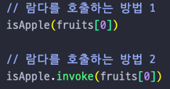
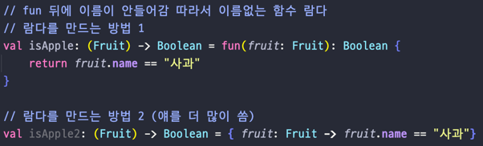
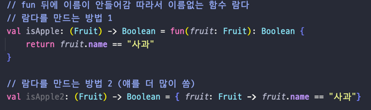
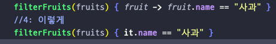

## Lec 17. 코틀린에서 람다를 다루는 방법

### 1. Java에서 람다를 다루기 위한 노력
### 2. 코틀린에서의 람다
### 3. Closure
### 4. 다시 try with resources

---

## 1. Java에서 람다를 다루기 위한 노력
- 인터페이스와 익명클래스를 이용해 무수한 메서드 생성을 막았다 
- 하지만 익명클래스를 만드는데 있어 아쉬운점이 있다
  - 코드가 문법적으로 복잡하다
  - 다양한 Filter가 필요하다.
- 위와 같은 문제를 해결하기위해 JDK8부터 람다(이름이 없는 함수)가 등장!
  - Predicate, Consumer 등의 여러 인터페이스들을 제공한다
  - 람다문법
    - 변수 -> 변수를 이용한 함수
    - (변수1, 변수2) -> 변수1과 변수2를 이용한 함수
  - Stream(병렬처리에도 강점이 있음)
    - for문과 if문을 깔끔하게 만들어준다.
    - 람다를 -> 메서드 레퍼런스로 바꿔서 더 짧게 바꿀 수 있다
      - 메서드 자체를 직접 넘겨주는 것처럼 쓸 수 있다.
        - 하지만 실제 함수를 넘기는것처럼 보이지만 실제 받는 것은 인터페이스를 받게 됨
    - Java에서 함수는 변수에 할당되거나 파라미터로 전달할 수 없다. = 2급시민

## 2. 코틀린에서의 람다
- 코틀린에서의 함수가 Java와 근본적으로 다른 한 가지
  - 코틀린에서는 함수가 그 자체로 값이 될 수 있다. 변수에 할당할수도, 파라미터로 넘길 수도 있다.
- 람다를 만드는 방법

- 람다를 호출하는 방법

- 함수의 타입: (파라미터 타입...) -> 반환 타입

- 코틀린에선 함수 자체를 파라미터로 받을 수 있고
- 그 다음 그 함수를 바로 불러서 로직을 작성할 수 있고
- 그 다음 함수를 작성한 측에선 메서드를 부를때 그 인수로 바로 넣어준다
- 따라서 코틀린은 함수 자체를 1급시민으로 간주해서 변수에 넣을 수도 있고 파라미터에 넣을 수도 있다.
- 함수를 부르는 쪽에서는 마지막 파라미터가 함수인 경우, 소괄호 밖에 람다 사용 가능! 
- 람다를 작성할때, 파라미터를 it 으로 직접 참조할 수 있다.(비추천)
- 람다는 여러줄 작성할 수 있고 마지막 줄의 결과가 람다의 반환값이다. 

## 3. Closure
- Java에서는 람다를 쓸 때 사용할 수 있는 변수에 제약이 있다
  - 람다 밖에 있는 변수를 사용하는 경우 제약이 있으며
  - final인 변수 혹은 실질적으로 final인 변수만 사용할 수 있다.
- 하지만 코틀린에서는 아무런 문제 없이 동작한다!
  - 이유: 코틀린에서는 람다가 시작하는 지점에 참조하고 있는 변수들을 모두 포획하여 그 정보를 가지고 있다.
  - 이러한 데이터 구조 즉 람다가 실행되는 시점에 쓰고 있는 변수들을 모두 포획한 데이터 구조를 Closure이라고하며 
  - 이렇게 해야 람다를 진정한 일급 시민으로 간주할 수 있다.

## 4. 다시 try with resources
- 코틀린에선 try with resources 대신 use를 사용한다 
- use 는 Closeable 구현체에 대한 확장함수이다.
- Inline 함수이다.
- 람다를 받게 만들어진 함수이다.(실제 람다를 전달하고 있다.)

---

## 총 정리
- 함수는 Java에서 2급시민이지만, 코틀린에서는 1급시민이다.
  - 때문에 함수 자체를 변수에 넣을 수도 있고
  - 파라미터로 전달할 수도 있다.
- 코틀린에서 함수 타입은 (파라미터 타, ...) -> 반환타입 이었다.
- 코틀린에서 람다는 두 가지 방법으로 만들 수 있고, 이 중 {} 방법이 더 많이 사용된다.

- 함수를 호출하며, 마지막 파라미터인 람다를 쓸 때는 소괄호 밖으로 람다를 뺼 수 있다.

- 람다의 마지막 expression 결과는 람다의 반환 값이다.
- 코틀린에서는 Closure를 사용하여 non-final 변수도 람다에서 사용할 수 있다.

