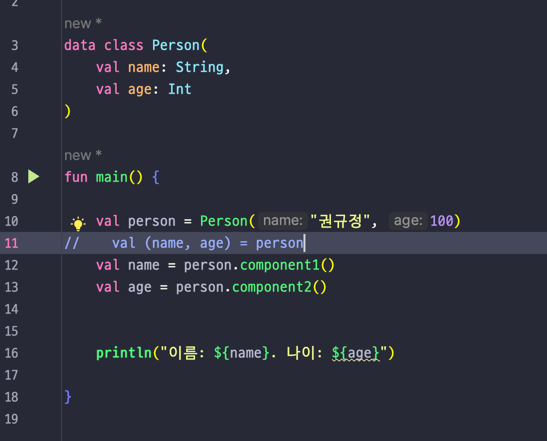
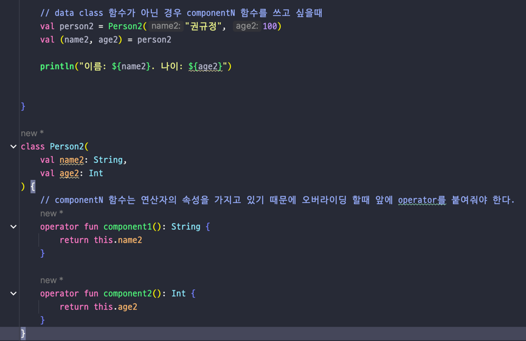
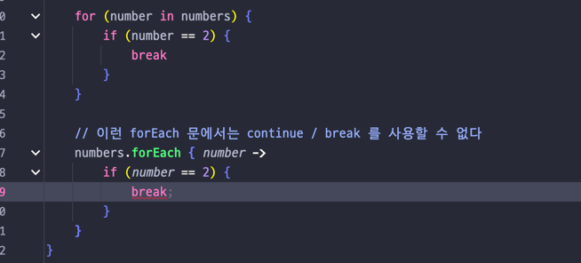
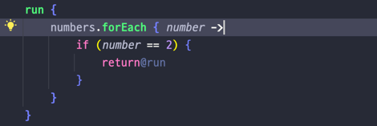
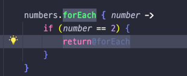
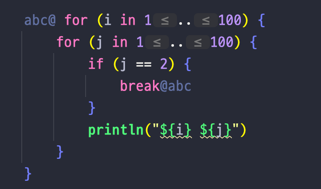
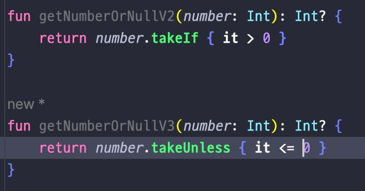

## Lec 19. 코틀린의 이모저모

### 1. Type Alias와 as import
### 2. 구조분해와 componentN 함수
### 3. Jump와 Label
### 4. TakeIf와 TakeUnless

---

## 1. Type Alias와 as import
- Type Alias: 긴 이름의 클래스 혹은 함수 타입이 있을때 축약하거나 더 좋은 이름을 쓰고싶을때 쓴다!
- as import: 다른 패키지의 같은 이름 함수를 동시에 가져오고 싶을때 쓴다!

## 2. 구조분해와 componentN 함수
- 구조분해: 복합적인 값을 분해하여 여러 변수를 한 번에 초기화하는 것
- Data Class는 componentN이란 함수도 자동으로 만들어준다!

```
    // 얘랑(구조 분해)
    val (name, age) = person
    
    // 얘내 둘은 같은 코드이다
    val name = person.component1()
    val age = person.component2()
```

- 만약 Data Class가 아닌데 구조분해를 사용하고 싶다면 componentN 함수를 직접 구현해줄 수도 있다.

- map을 for문에 사용할때 (key, value), 인덱스를 같이 얻어올때 (idx, element) 같은 문법 역시 구조분해이다!


## 3. Jump와 Label
- **return / break / continue**


- return: 기본적으로 가장 가까운 enclosion function 또는 익명함수로 값이 반환된다.
- break: 가장 가까운 루프가 제거된다.
- continue: 가장 가까운 루프를 다음 step으로 보낸다


- forEach 문에서는 break, continue 사용 불가


- 굳이 break를 forEach와 쓰고 싶다면 아래 사진처럼 사용 가능



- 굳이 continue를 forEach와 쓰고 싶다 아래 사진처럼 사용 가능



- 하지만 break, continue 사용시 가급적 익숙한 for문을 사용하자!


- 코틀린에는 라벨이라는 기능이 있다.
- Label: 특정 expression에 라벨이름@ 을 붙여 하나의 라벨로 간주하고 break, contunue, return 등을 사용하는 기능

- 원래 위의 사진의 이중for문의 경우 break를 걸면 안쪽의 for문이 break가 걸리지만 이렇게 라벨을 주게되면 라벨이 걸린 바깥쪽 for문에 break가 걸린다.
- 라벨을 사용한 Jump는 사용하지 않는 것을 강력 추천!

## 4. TakeIf와 TakeUnless
- 코틀린에서는 method chaning을 위한 특이한 함수를 제공한다.
- TakeIf: 주어진 조건을 만족하면 그 값이, 그렇지 않으면 null이 반환된다.
- TakeUnless: 주어진 조건을 만족하지 않으면 그 값이, 그렇지 않으면 null이 반환된다.


---

## 총 정리
- 타입에 대한 별칭을 줄 수 있는 typealias 라는 키워드가 존재한다
- import 당시 이름을 바꿀 수 있는 as import 기능이 존재한다
- 변수를 한 번에 선언할 수 있는 구조분해 기능이 있다. componentN 함수를 사용한다.
- for문, while문과 달리 forEach에는 break와 continue를 사용할 수 없다.
- takeIf와 takeUnless를 활용해 코드양을 줄이고 method chaning을 활용할 수 있다.


