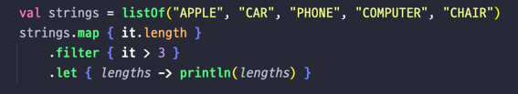

## Lec 20. 코틀린의 scope function

### 1. scope function이란 무엇인가?!
### 2. scope function의 분류
### 3. 언제 어떤 scope function을 사용해야 할까?!
### 4. scope function과 가독성

--- 

## 1. scope function이란 무엇인가?!
- scope function: 일시적인 영역을 형성하는 함수

- Safe Call (?.)을 사용: person이 null이 아닐때에 let을 호출
- let
  - scope function의 한 종류
  - 확장함수.람다를 받아, 람다 결과를 반환한다.
  - 람다를 사용해 일시적인 영역을 만들고 코드를 더 간결하게 만들거나, method chaning에 활용하는 함수를 scope function이라고 합니다.

## 2. scope function의 분류
- let / run / also / apply / with(확장함수 아님)
  - 확장함수(마치 멤버 함수를 쓰는것처럼 사용되는 함수)
    - let: 람다의 결과를 반환 (it 사용)
      - let은 일반 함수를 받는데 일반 함수는 파라미터를 받아 파라미터를 함수 내부에서 호출한다 그렇기 때문에 파라미터에 대한 이름을 직접 넣어줄 수 있다.
      - 따라서 let 에서 사용하는 it은 ```it.age 말고도 p -> person.age 이렇게도 가능하다```
    - run: 람다의 결과를 반환 (this 사용)
      - run은 확장 함수를 받는데 확장함수는 본인 자신을 this로 호출하고 생략할 수 있다는 특징이 있어 생략이 가능하다
      - 따라서 run 에서 사용하는 this는 ```this.age 말고도 age 이렇게도 가능하다 ```
    - also: 객체 그 자체를 반환 (it 사용)
    - apply: 객체 그 자체를 반환 (this 사용)
      - it: 생략이 불가능한 대신, 다른 이름을 붙일 수 있다.
      - this: 생략이 가능한 대신, 다른 이름을 붙일 수 있다.
      
  - 확장함수가 아닌 것
    - with(파라미터, 람다): this를 사용해 접근하고, this는 생략 가능하다(this 사용)

## 3. 언제 어떤 scope function을 사용해야 할까?!
- let
  - 하나 이상의 함수를 call chain 결과로 호출 할 때 사용한다.
    
  - non-null 값에 대해서만 code block을 실행시킬 때 (이게 가장 많이 사용된다.)
    
  - 일회성으로 제한된 영역에 지역 변수를 만들 때
    
- run 
  - 객체 초기화와 반환 값의 계산을 동시에 해야 할 때 사용한다.
    - 객체를 만들어 DB에 바로 저장하고, 그 인스턴스를 활용할 때 사용한다. run을 쓰면 실제 DB에 저장되어 있는 객체가 나오게 된다.
    - 잘 사용하지 않는다. ( 생성자가 너무 길어지는 경우에는 쓰게되면 코드가 깨끗해진다. )
- apply
  - 객체 설정을 할 때에 객체를 수정하는 로직이 call chain 중간에 필요할 때 사용한다.
    - 보통 Test Fixture를 만들 때 사용한다.
- also
  - 객체를 수정하는 로직이 call chain 중간에 필요할 때 사용한다.
  
  - 위 아래는 같은 코드이다.
- with
  - 특정 객체를 다른 객체로 변환해야 하는데, 모듈 간의 의존성 의해 정적 팩토리 혹은 toClass 함수를 만들기 어려울 때 사용한다.
  - 객체를 converting해야하는데 한쪽에 로직을 넣기 어려울때 사용한다.

## 4. scope function과 가독성
- 과연 scope function을 사용한 코드가 그렇지 않은 코드보다 가독성 좋은 코드일까? => No!!! 오히려 디버깅이 어려워지고 읽기 어려워 질 수 있다.
- 사용 빈도가 적은 관용구는 코드를 더 복잡하게 만들고 이런 관용구들을 한 문장 내에서 조합해 사용하면 복잡성이 증가한다.
- 하지만 scope function을 사용하면 안되는 것도 아니다! 적절한 convention을 적용하면 유용하게 활용할 수 있다.

---

## 총 정리
- 코틀린의 scope function은 일시적인 영역을 만들어 코드를 더 간결하게 하거나, method chain에 활용된다.
- scope function의 종류에는 let / run / also / apply / with가 있었다. 
- scope function을 사용한 코드는 사람 따라 가독성을 다르게 느낄 수 있기 때문에, 함께 프로덕트를 만들어 가는 팀끼리 convention을 잘 정해야 한다.

